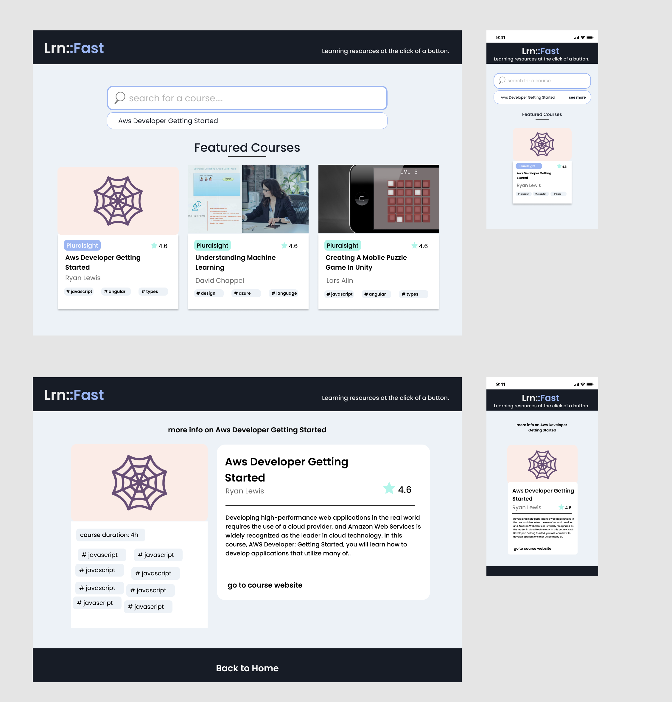

# Lrn::Fast

This is the frontend of an online course catalogue web app with search and filter features. This web app also uses redux under the hood to hold the state of a shopping cart.

## Video demo


## Built With

- React
- Redux toolkit
- Tailwind CSS

## Original UI design



## Getting Started

**To get started, follow the instructions below**

To get a local copy up and running follow these simple steps.

- git clone the repo

```
git clone https://github.com/onedebos/learn-fast && cd lrn-fast
```

- Install all the required packages with

```
npm install
```

- Start the server

```
npm start
```

### Automated Tests

- Currently, there are no automated tests avaailable for this project. This will be implemented at a later date.

## Authors

👤 **Adebola**

- Github: [@githubhandle](https://github.com/onedebos)
- Twitter: [@twitterhandle](https://twitter.com/debosthefirst)
- Linkedin: [linkedin](https://www.linkedin.com/in/adebola-niran/)

## 🤝 Contributing

Contributions, issues and feature requests are welcome!

Feel free to check the [issues page](issues/).

## Show your support

Give a ⭐️ if you like this project!

## Acknowledgments

## 📝 License

This project is [MIT](lic.url) licensed.

```

```
